# CAD to AR Portal
2019 Conestoga Capstone Project "CAD to AR Portal"

***

## 0. Award
<!--- --->

***

## 1. Description of CAD to AR Portal

### 1.1. Project Information
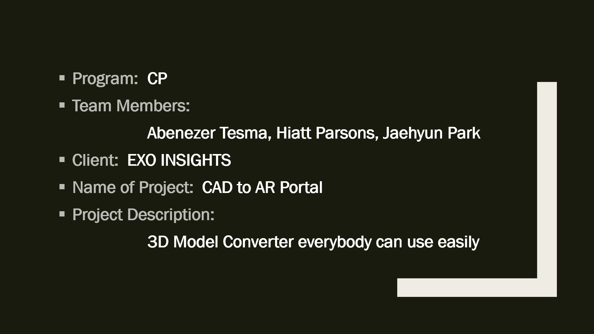

> ### About Our Client
> EXO Insights provides an industrial safety and training system using advanced AR/VR systems for energy companies in high-risk working environments

### 1.2. Problem
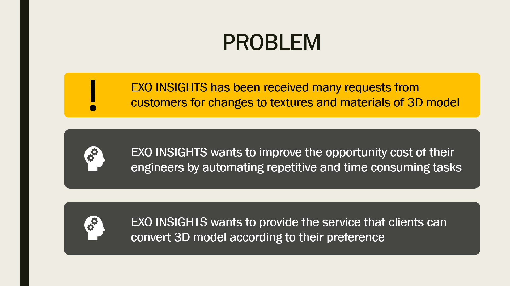

### 1.3. Solution
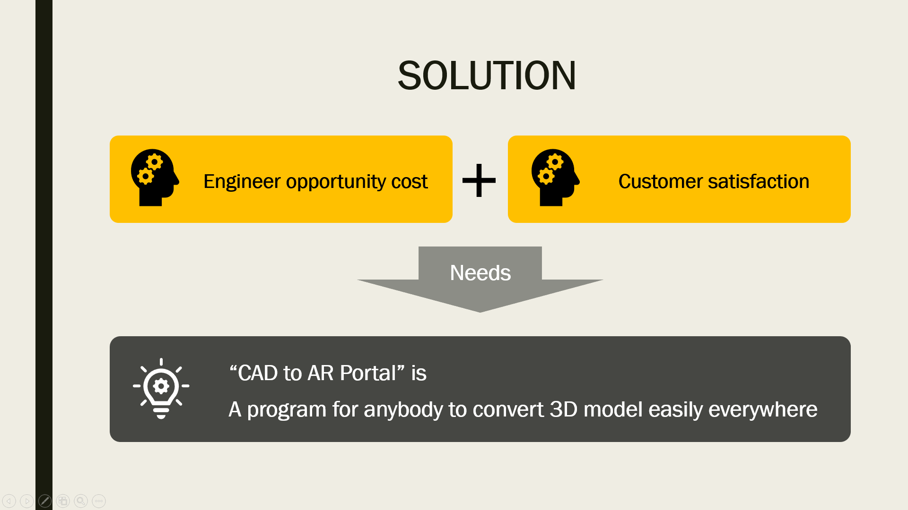

***

## 2. Technologies
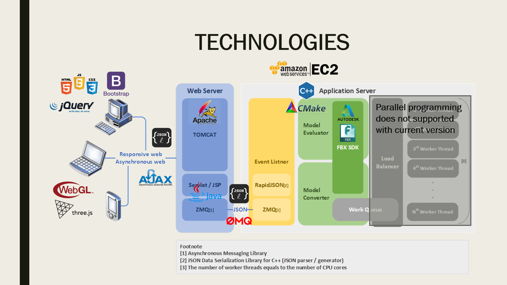

> ### Web Front-End
> HTML5, CSS3, jQuery, Bootstrap, AJAX
>
> ### 3D Model Display
> WebGL (threejs)
>
> ### Web Back-End
> JSP/Servlet
>
> ### Messaging System
> Data serialized in JSON over ZMQ
>
> ### 3D Model Converter
> FBX SDK(C++), CMake
>
> ### Amazon EC2
> [User Guide](https://docs.aws.amazon.com/AWSEC2/latest/UserGuide/concepts.html)  
> [How to Create EC2 Resources and Launch EC2 Instance](https://docs.aws.amazon.com/efs/latest/ug/gs-step-one-create-ec2-resources.html)  
> [How to add new user accounts with SSH to EC2 Linux instance](https://aws.amazon.com/premiumsupport/knowledge-center/new-user-accounts-linux-instance/?nc1=h_ls)

### 2.1. Messaging System
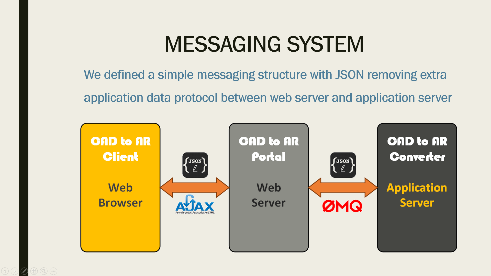

***

## 3. 3D Model Converting

### 3.1. 3D Model Structure (Example)
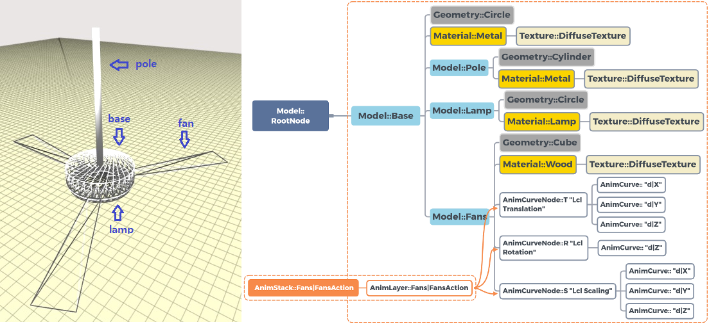

### 3.2. 3D Model Converting Process
> **Step-1. Load model and remove the existing materials**
> 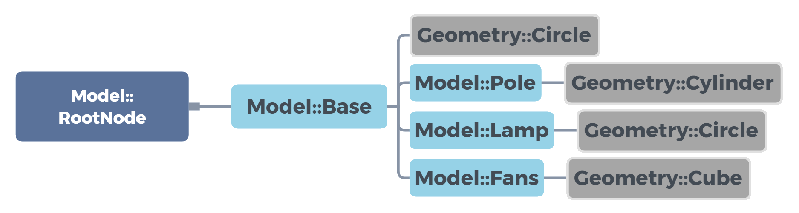
>
> **Step-2. Create a new material node and connect to mesh node**
> 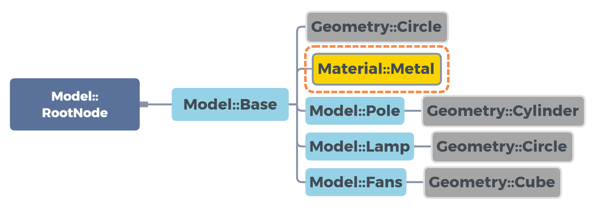
>
> **Step-3. Create a new texture node and connect to material node**
> 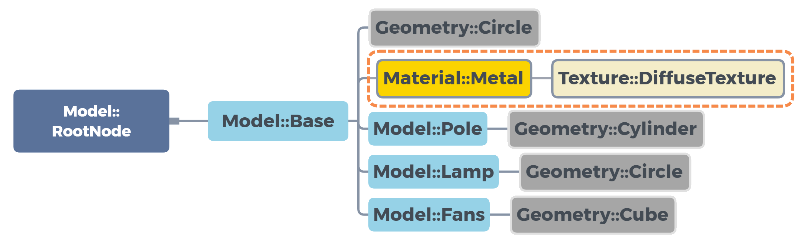
>
> **Step-4. Traverse all child nodes and repeat Step2 and 3**
> 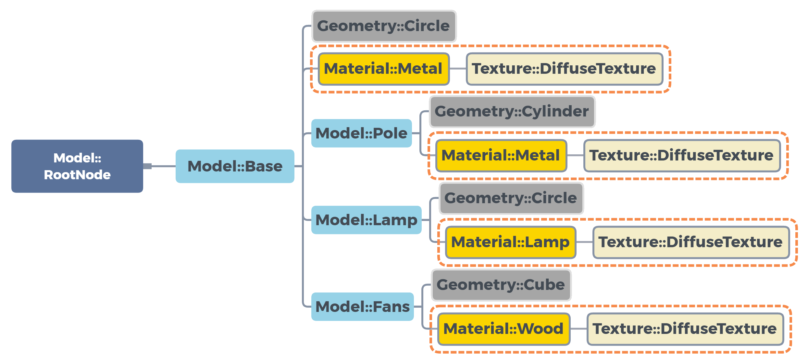
>

***

## 4. Screen Shots (4 step process)
**Step-1. Upload**
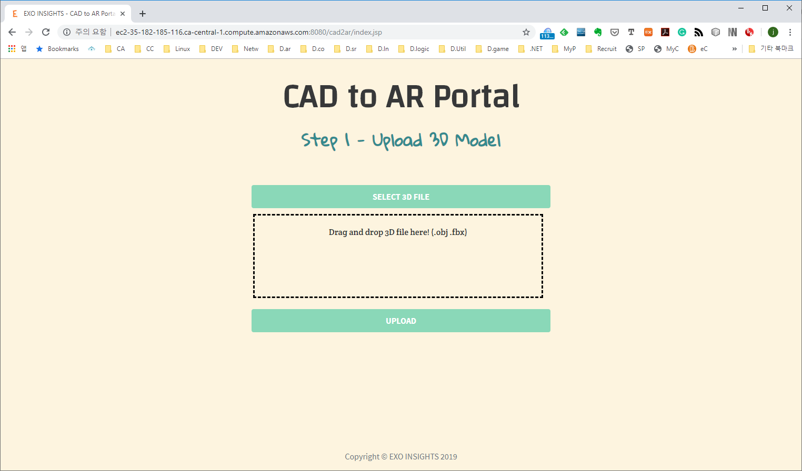

**Step-2. Evaluate**
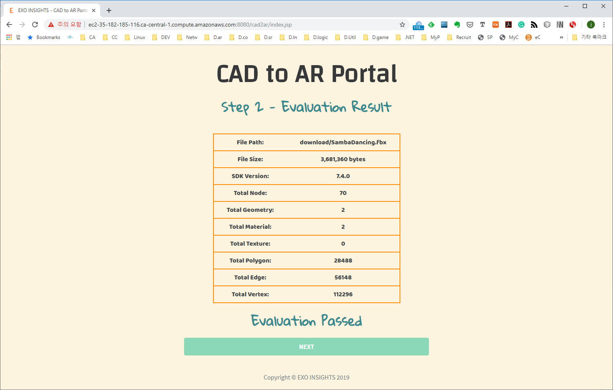

**Step-3. Convert**
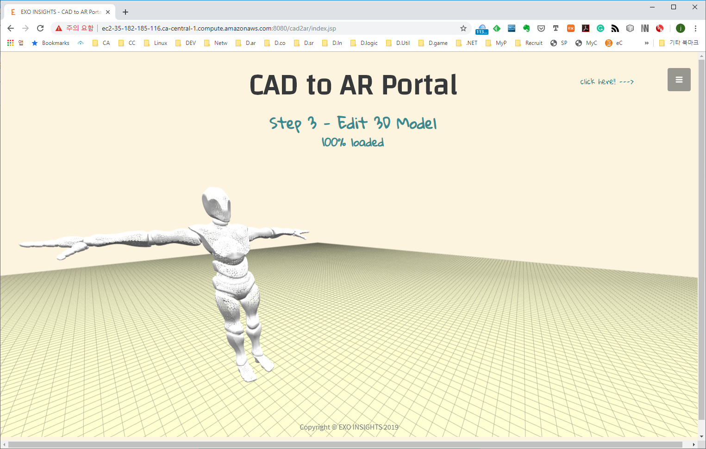
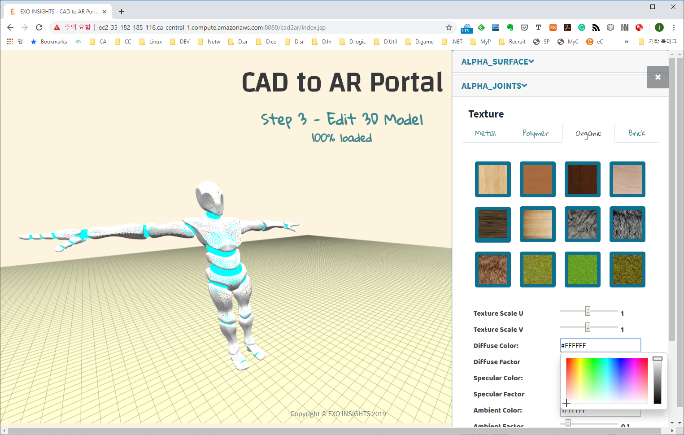

**Step-4. Download**
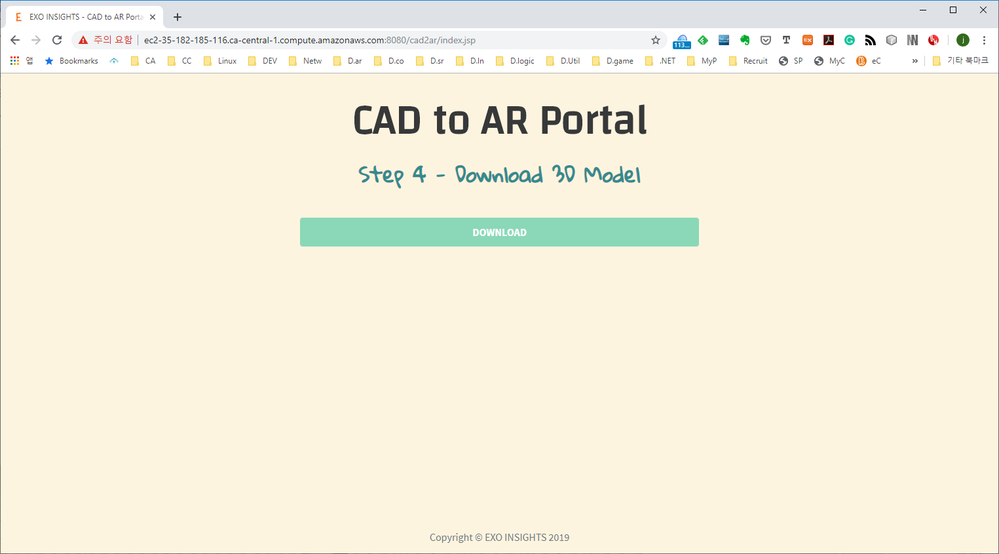

**Output**  
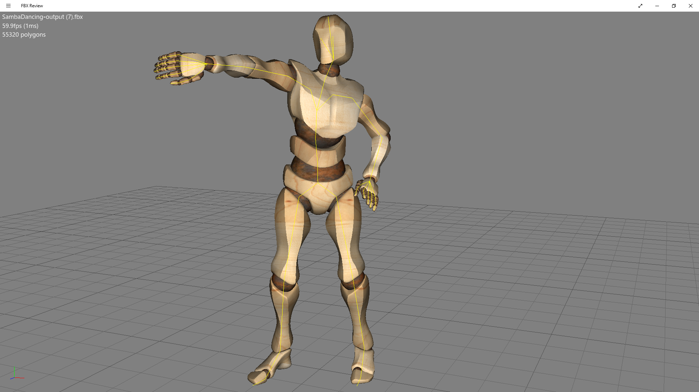
